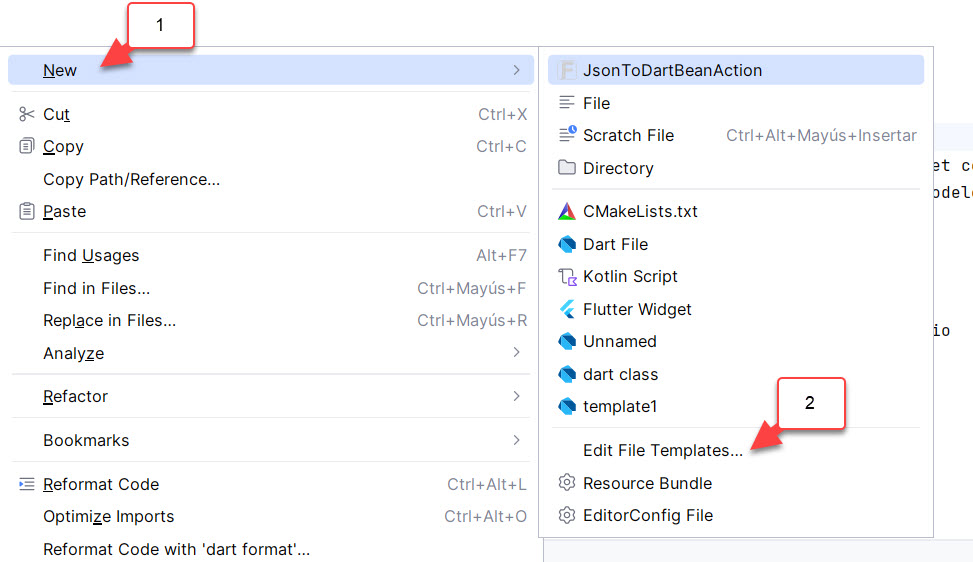
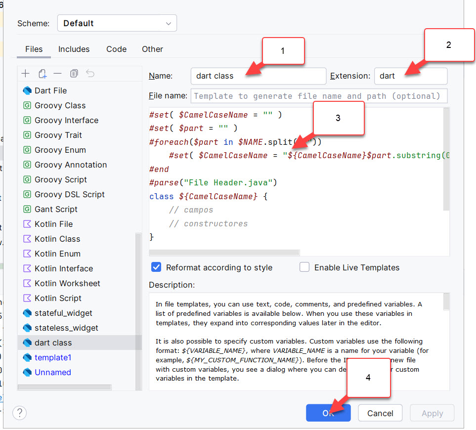

# ejercicioflutter20240726_2

Ejercicio de Carro de Compras

## Modelo

* Categoria
  * Id
  * Nombre

* Producto
   * Id
   * Nombre
   * Precio
   * NombreCategoria
  
* Compra
  * Id
  * NombreProducto
  * Cantidad

## Servicio
> No hablan o hacen operaciones con la interface visual.
> Habla de datos, conexiones a web service, guardar los datos, operacion (sumar, promedio).

* CategoriaSrv
* ProductoSrv
* CompraSrv

## Paginas
> Son widgets con estado o sin estado.

* CategoriaListarPagina
* CategoriaInsertarPagina
* ProductoListarPagina
* ProductoInsertarPagina
* CompraListarPagina
* CompraInsertarPagina

# Pasos

- [x] Limpiar el proyecto  
- [x] En main.dart, voy a borrar el widget con estado  
  - [x] Luego voy a partir creando los modelos (siempre se parte con los modelos)

- [x] categoria  
- [x] producto  
- [x] compra  
- [x] Clases de servicio
  - [x] categoriasrv  
    - [x] obtenerCategorias()
    - [x] agregarCategorias()
  - [ ] productosrv  
  - [ ] comprasrv  
- [x] paginas  
  - [x] CategoriaListarPagina  
  - [x] CategoriaInsertarPagina (formulario)
  - [x] ProductoListarPagina
  - [x] ProductoInsertarPagina (formulario)
  - [ ] CompraListarPagina
  - [ ] CompraInsertarPagina (formulario)

- [ ] widgets (listado)
  - [x] CategoriaListView
  - [ ] ProductoListView
  - [ ] CompraListView
- [ ] widget (fila)
  - [x] CategoriaFila
  - [ ] ProductoFila
  - [ ] CompraFila
- [ ] widget (formulario)
  - [x] CategoriaInsertarForm
  - [ ] ProductoInsertarForm
  - [ ] CompraInsertarFormul


## Creación de template para clase (opcional)

Cree el siguiente template

En Android Studio, selecciona una carpeta, y con el botón derecho -> new -> Edit File Template




* Indique un nombre
* En extension indique dart
* Y pegue el siguiente codigo.



```
#set( $CamelCaseName = "" )
#set( $part = "" )
#foreach($part in $NAME.split("_"))
    #set( $CamelCaseName = "${CamelCaseName}$part.substring(0,1).toUpperCase()$part.substring(1).toLowerCase()" )
#end
#parse("File Header.java")
class ${CamelCaseName} {
    // campos
    // constructores    
}
```

Este template luego lo puede ocupar cuando crea un archivo nuevo.

